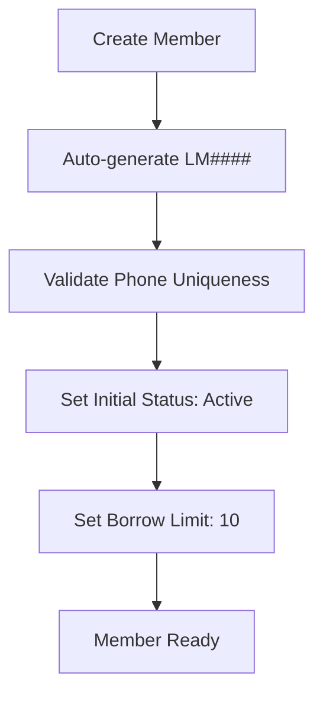
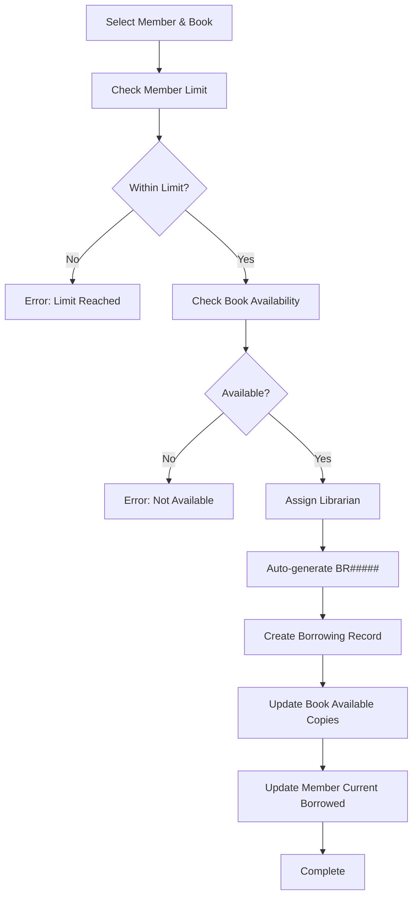
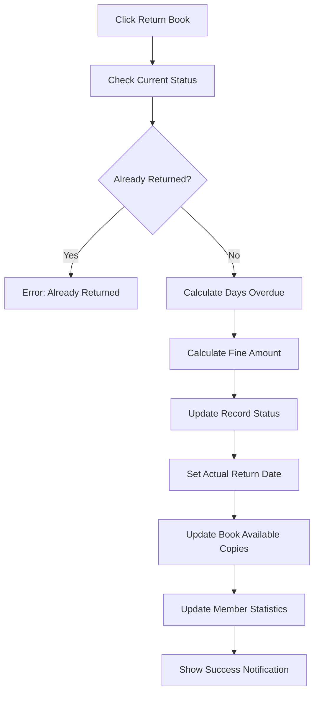

# Library Management System - Comprehensive Documentation

## 📋 **Overview**

A complete Library Management System built on Odoo 18.0 that manages books, members, librarians, and borrowing operations with automated fine calculations, real-time inventory tracking, and comprehensive reporting.

## 🏗️ **System Architecture**

### **Module Structure**
```
library_management_1/
├── __manifest__.py          # Module configuration
├── __init__.py              # Module initialization
├── models/                  # Data models and business logic
│   ├── __init__.py         # Model imports
│   ├── member.py           # Member management
│   ├── book.py             # Book inventory
│   ├── borrowing_record.py # Borrowing transactions
│   └── librarian.py        # Librarian management
├── views/                   # User interface definitions
│   ├── member_views.xml    # Member UI
│   ├── book_views.xml      # Book UI  
│   ├── borrowing_record_views.xml # Borrowing UI
│   ├── librarian_views.xml # Librarian UI
│   └── views_menu.xml      # Navigation menu
├── data/                    # Data and automation
│   ├── sequence_data.xml   # Auto-numbering sequences
│   └── ir_cron_data.xml    # Scheduled tasks
├── security/                # Access control
│   └── ir.model.access.csv # Permissions
└── static/                  # Static assets
    └── description/
        └── icon.png         # Module icon
```

---

## 🗄️ **Data Models**

### **1. Member Model (`library.member`)**

**Purpose**: Manages library member information with dynamic borrowing limits based on status.

**Key Fields:**
```python
# Core Information
sequence = fields.Char()           # Auto-generated: LM0001, LM0002...
name = fields.Char()               # Member name
email = fields.Char()              # Contact email
phone = fields.Char()              # Unique phone number
join_date = fields.Date()          # Registration date

# Status Management
member_status = fields.Selection([
    ('active', 'Active'),          # 10 books limit
    ('inactive', 'Inactive'),      # 5 books limit  
    ('pending', 'Pending')         # 5 books limit
])

# Dynamic Limits
max_borrow_limit = fields.Integer() # Auto-set based on status
current_borrowed = fields.Integer() # Real-time count
```

**Business Logic:**
```python
@api.onchange('member_status')
def _onchange_member_status(self):
    """Update borrow limit when status changes"""
    if self.member_status == 'active':
        self.max_borrow_limit = 10
    elif self.member_status in ['inactive', 'pending']:
        self.max_borrow_limit = 5

@api.constrains('member_status', 'current_borrowed')
def _check_status_change_borrowing_limit(self):
    """Prevent status change if member has too many books"""
    for record in self:
        if record.member_status in ['inactive', 'pending'] and record.current_borrowed > 5:
            raise ValidationError(
                f'Cannot change member "{record.name}" to {record.member_status.title()} status. '
                f'Member currently has {record.current_borrowed} borrowed books.'
            )
```

**Statistics (Computed Fields):**
```python
@api.depends('borrowing_ids', 'borrowing_ids.status')
def _compute_current_borrowed(self):
    """Real-time count of borrowed books"""
    for member in self:
        member.current_borrowed = len(member.borrowing_ids.filtered(lambda b: b.status == 'borrowed'))

@api.depends('borrowing_ids', 'borrowing_ids.fine_amount')
def _compute_statistics(self):
    """Calculate comprehensive member statistics"""
    for member in self:
        borrowings = member.borrowing_ids
        member.total_books_borrowed = len(borrowings)
        member.total_fines = sum(borrowings.mapped('fine_amount'))
        member.overdue_books_count = len(borrowings.filtered(lambda b: b.status == 'overdue'))
        member.returned_books_count = len(borrowings.filtered(lambda b: b.status == 'returned'))
```

---

### **2. Book Model (`library.book`)**

**Purpose**: Manages book inventory with real-time availability tracking.

**Key Fields:**
```python
# Core Information
title = fields.Char()              # Book title
author = fields.Char()             # Author name
isbn = fields.Char()               # Unique ISBN (SQL constraint)
category = fields.Selection([      # 7 categories with color coding
    ('fiction', 'Fiction'),
    ('science', 'Science'),
    ('technology', 'Technology'),
    # ... more categories
])

# Inventory Management
total_copies = fields.Integer()     # Total books owned
available_copies = fields.Integer() # Real-time availability
borrowing_record_ids = fields.One2many() # All borrowing history
```

**Real-Time Availability:**
```python
@api.depends('total_copies', 'borrowing_record_ids.status')
def _compute_available_copies(self):
    """Calculate available copies in real-time"""
    for book in self:
        # Count both borrowed and overdue as unavailable
        unavailable_count = len(book.borrowing_record_ids.filtered(
            lambda r: r.status in ['borrowed', 'overdue']
        ))
        book.available_copies = max(0, book.total_copies - unavailable_count)
```

**Data Integrity:**
```python
_sql_constraints = [
    ('unique_isbn', 'UNIQUE(isbn)', 'ISBN must be unique!')
]

@api.constrains('isbn')
def _check_isbn_unique(self):
    """Additional ISBN validation with detailed error message"""
    for book in self:
        if book.isbn:
            existing_book = self.search([('isbn', '=', book.isbn), ('id', '!=', book.id)], limit=1)
            if existing_book:
                raise ValidationError(
                    f'A book with ISBN {book.isbn} already exists: '
                    f'"{existing_book.title}" by {existing_book.author}.'
                )
```

---

### **3. Borrowing Record Model (`library.borrowing.record`)**

**Purpose**: Manages all borrowing transactions with automated status updates and fine calculations.

**Key Fields:**
```python
# Core Transaction Data
sequence = fields.Char()           # Auto-generated: BR00001, BR00002...
member_id = fields.Many2one()      # Member reference
book_id = fields.Many2one()        # Book reference
librarian_id = fields.Many2one()   # Processing librarian (required)

# Date Management
borrow_date = fields.Date()        # When borrowed
expected_return_date = fields.Date() # Due date
actual_return_date = fields.Date()  # When returned (if returned)

# Status Tracking
status = fields.Selection([
    ('borrowed', 'Borrowed'),       # Currently with member
    ('returned', 'Returned'),       # Returned successfully
    ('overdue', 'Overdue')         # Past due date
])

# Fine Calculation
days_overdue = fields.Integer()     # Current overdue days
fine_amount = fields.Float()       # Calculated fine (RM 5/day)
fine_per_day = fields.Float()      # Configurable rate
```

**Dynamic Overdue Calculation:**
```python
@api.depends('expected_return_date', 'actual_return_date', 'status')
def _compute_days_overdue(self):
    """Calculate days overdue for all statuses"""
    for record in self:
        if record.status in ['borrowed', 'overdue']:
            # Real-time calculation for active loans
            reference_date = fields.Date.today()
            if record.expected_return_date and reference_date > record.expected_return_date:
                delta = reference_date - record.expected_return_date
                record.days_overdue = delta.days
            else:
                record.days_overdue = 0
        elif record.status == 'returned' and record.actual_return_date:
            # Historical calculation for returned books
            if record.actual_return_date > record.expected_return_date:
                delta = record.actual_return_date - record.expected_return_date
                record.days_overdue = delta.days
            else:
                record.days_overdue = 0
```

**Validation and Business Rules:**
```python
@api.model
def create(self, vals):
    """Validate borrowing limits and book availability before creation"""
    # Check member borrowing limit
    if vals.get('member_id'):
        member = self.env['library.member'].browse(vals['member_id'])
        current_borrowed = self.search_count([
            ('member_id', '=', vals['member_id']),
            ('status', '=', 'borrowed')
        ])
        if current_borrowed >= member.max_borrow_limit:
            raise ValidationError(
                f'Member "{member.name}" has reached the borrowing limit of {member.max_borrow_limit} books.'
            )
    
    # Check book availability
    if vals.get('book_id'):
        book = self.env['library.book'].browse(vals['book_id'])
        if book.available_copies < 1:
            raise ValidationError(f'Book "{book.title}" is not available for borrowing.')
    
    # Auto-set overdue status for past due dates
    if vals.get('expected_return_date'):
        expected_date = fields.Date.from_string(vals['expected_return_date'])
        if expected_date < fields.Date.today():
            vals['status'] = 'overdue'
    
    return super(BorrowingRecord, self).create(vals)
```

**Return Process:**
```python
def action_return_book(self):
    """Process book return with automatic fine calculation"""
    self.ensure_one()
    
    if self.status == 'returned':
        raise ValidationError('This book has already been returned.')
    
    return_date = fields.Date.today()
    fine_amount = 0.0
    
    # Calculate fine if overdue
    if return_date > self.expected_return_date:
        days_overdue = (return_date - self.expected_return_date).days
        fine_amount = days_overdue * self.fine_per_day
    
    self.write({
        'actual_return_date': return_date,
        'status': 'returned',
        'fine_amount': fine_amount
    })
    
    return {
        'type': 'ir.actions.client',
        'tag': 'display_notification',
        'params': {
            'title': 'Book Returned',
            'message': f'Book returned successfully. Fine: RM {fine_amount:.2f}',
            'type': 'success',
        }
    }
```

**Data Protection:**
```python
def unlink(self):
    """Prevent deletion of unreturned books"""
    for record in self:
        if record.status in ['borrowed', 'overdue']:
            raise ValidationError(
                f'Cannot delete borrowing record "{record.sequence}" '
                f'for "{record.member_name} - {record.book_title}". '
                f'The book has not been returned yet (Status: {record.status.title()}). '
                f'Please return the book first before deleting this record.'
            )
    return super(BorrowingRecord, self).unlink()
```

---

### **4. Librarian Model (`library.librarian`)**

**Purpose**: Manages librarian information with performance tracking and access control.

**Key Fields:**
```python
# Core Information
name = fields.Char()               # Librarian name
employee_id = fields.Char()        # Unique ID (LIB001 format)
email = fields.Char()              # Email with validation
phone = fields.Char()              # Phone with validation
hire_date = fields.Date()          # Employment start date
active = fields.Boolean()          # Active/inactive status

# Organizational Structure
department = fields.Selection([
    ('circulation', 'Circulation'),
    ('reference', 'Reference'),
    ('cataloging', 'Cataloging'),
    ('administration', 'Administration')
])

position = fields.Selection([
    ('assistant', 'Library Assistant'),
    ('librarian', 'Librarian'),
    ('senior_librarian', 'Senior Librarian'),
    ('head_librarian', 'Head Librarian')
])

# Performance Tracking
years_of_service = fields.Float()  # Auto-calculated
managed_borrowings = fields.One2many() # All processed transactions
total_managed_borrowings = fields.Integer() # Performance count
```

**Validation and Formatting:**
```python
@api.constrains('employee_id')
def _check_employee_id_format(self):
    """Validate employee ID follows LIB### pattern"""
    for record in self:
        if record.employee_id:
            if not re.match(r'^LIB\d{3,}$', record.employee_id):
                raise ValidationError(
                    f"Employee ID '{record.employee_id}' must follow the format 'LIBxxx' "
                    f"where xxx is a number (e.g., LIB001, LIB123)."
                )

@api.depends('hire_date')
def _compute_years_of_service(self):
    """Calculate years of service automatically"""
    for librarian in self:
        if librarian.hire_date:
            today = fields.Date.today()
            delta = today - librarian.hire_date
            librarian.years_of_service = round(delta.days / 365.25, 1)
        else:
            librarian.years_of_service = 0
```

---

## 🔄 **Business Workflows**

### **1. Member Registration Flow**



**Implementation:**
```python
@api.model
def create(self, vals):
    # Auto-generate member number
    if vals.get('sequence', 'New') == 'New':
        vals['sequence'] = self.env['ir.sequence'].next_by_code('library.member') or 'New'
    
    # Set initial borrow limit based on status
    if vals.get('member_status') == 'active':
        vals['max_borrow_limit'] = 10
    else:
        vals['max_borrow_limit'] = 5
    
    return super(Member, self).create(vals)
```

### **2. Book Borrowing Flow**



**Implementation:**
```python
# In borrowing_record.py create method
if vals.get('member_id'):
    member = self.env['library.member'].browse(vals['member_id'])
    current_borrowed = self.search_count([
        ('member_id', '=', vals['member_id']),
        ('status', '=', 'borrowed')
    ])
    if current_borrowed >= member.max_borrow_limit:
        raise ValidationError(f'Member has reached borrowing limit')

if vals.get('book_id'):
    book = self.env['library.book'].browse(vals['book_id'])
    if book.available_copies < 1:
        raise ValidationError(f'Book not available')
```

### **3. Book Return Flow**



**Implementation:**
```python
def action_return_book(self):
    if self.status == 'returned':
        raise ValidationError('This book has already been returned.')
    
    return_date = fields.Date.today()
    fine_amount = 0.0
    
    if return_date > self.expected_return_date:
        days_overdue = (return_date - self.expected_return_date).days
        fine_amount = days_overdue * self.fine_per_day
    
    self.write({
        'actual_return_date': return_date,
        'status': 'returned',
        'fine_amount': fine_amount
    })
```

---

## 🤖 **Automated Systems**

### **1. Daily Overdue Fine Calculator**

**Schedule**: Daily at 2:00 AM

**Purpose**: Automatically calculate and update fines for overdue books.

```python
@api.model
def cron_calculate_overdue_fines(self):
    """Daily cron job for overdue fine calculation"""
    try:
        # Find borrowed records past due date
        overdue_records = self.search([
            ('status', '=', 'borrowed'),
            ('expected_return_date', '<', fields.Date.today())
        ])
        
        for record in overdue_records:
            days_overdue = (fields.Date.today() - record.expected_return_date).days
            fine_amount = days_overdue * record.fine_per_day
            
            record.write({
                'status': 'overdue',
                'fine_amount': fine_amount,
                'days_overdue': days_overdue
            })
        
        # Update existing overdue records
        existing_overdue = self.search([
            ('status', '=', 'overdue'),
            ('expected_return_date', '<', fields.Date.today())
        ])
        
        for record in existing_overdue:
            days_overdue = (fields.Date.today() - record.expected_return_date).days
            new_fine_amount = days_overdue * record.fine_per_day
            
            if record.fine_amount != new_fine_amount or record.days_overdue != days_overdue:
                record.write({
                    'fine_amount': new_fine_amount,
                    'days_overdue': days_overdue
                })
        
        return True
    except Exception as e:
        _logger.error(f'Error in cron_calculate_overdue_fines: {str(e)}')
        return False
```

**Configuration** (`data/ir_cron_data.xml`):
```xml
<record id="ir_cron_calculate_overdue_fines" model="ir.cron">
    <field name="name">Calculate Overdue Fines</field>
    <field name="model_id" ref="model_library_borrowing_record"/>
    <field name="state">code</field>
    <field name="code">model.cron_calculate_overdue_fines()</field>
    <field name="interval_number">1</field>
    <field name="interval_type">days</field>
    <field name="active" eval="True"/>
    <field name="user_id" ref="base.user_admin"/>
</record>
```

### **2. Weekly Member Status Review**

**Schedule**: Weekly on Sundays at 3:00 AM

**Purpose**: Review member statuses and flag potential issues.

```python
@api.model
def cron_review_member_status(self):
    """Weekly member status review and reporting"""
    try:
        members_with_overdue = self.search([
            ('overdue_books_count', '>', 0),
            ('member_status', '=', 'active')
        ])
        
        inactive_members = self.search([
            ('member_status', '=', 'inactive'),
            ('current_borrowed', '=', 0)
        ])
        
        pending_members = self.search([
            ('member_status', '=', 'pending')
        ])
        
        _logger.info(
            f'Weekly Member Status Review:'
            f'\n- Active members with overdue books: {len(members_with_overdue)}'
            f'\n- Inactive members: {len(inactive_members)}'
            f'\n- Pending members: {len(pending_members)}'
            f'\n- Total members: {len(self.search([]))}'
        )
        
        return True
    except Exception as e:
        _logger.error(f'Error in cron_review_member_status: {str(e)}')
        return False
```

---

## 🎨 **User Interface Components**

### **1. Navigation Structure**

**Main Menu** (`views/views_menu.xml`):
```xml
<menuitem id="library_member_root_menu" name="Library Management 01" sequence="-100"/>
├── <menuitem name="Members" action="library_member_action"/>
├── <menuitem name="Books" action="library_book_action"/>  
├── <menuitem name="Borrowing Records" action="library_borrowing_record_action"/>
└── <menuitem name="Librarians" action="library_librarian_action"/>
```

### **2. View Types per Model**

#### **Member Views** (`views/member_views.xml`):
- **List View**: Member overview with status badges and progress bars
- **Form View**: Detailed member information with statistics tabs
- **Kanban View**: Card-based view for quick member overview
- **Search View**: Advanced filtering and grouping options

**Key Features:**
```xml
<!-- Status-based color coding -->
<list decoration-warning="current_borrowed >= max_borrow_limit"
      decoration-info="member_status == 'active'"
      decoration-muted="member_status == 'inactive'">

<!-- Progress bar for borrow limit -->
<field name="borrow_limit_progress" widget="progressbar"/>

<!-- Smart buttons for actions -->
<button name="action_new_borrowing" string="New Borrowing" type="object"/>
```

#### **Book Views** (`views/book_views.xml`):
- **List View**: Book inventory with availability indicators
- **Form View**: Detailed book information with borrowing history
- **Kanban View**: Visual book catalog with cover images

**Key Features:**
```xml
<!-- Availability-based color coding -->
<list decoration-danger="available_copies == 0"
      decoration-warning="available_copies <= 2">

<!-- Category badges with color coding -->
<field name="category" widget="badge" 
       decoration-bf="category == 'technology'"
       decoration-info="category == 'science'"/>

<!-- Book cover display in kanban -->

```

#### **Borrowing Record Views** (`views/borrowing_record_views.xml`):
- **List View**: Transaction overview with status indicators
- **Form View**: Detailed borrowing information with action buttons

**Key Features:**
```xml
<!-- Status-based color coding -->
<list decoration-info="status == 'borrowed'"
      decoration-success="status == 'returned'"
      decoration-danger="status == 'overdue'">

<!-- Dynamic button visibility -->
<button name="action_return_book" string="Return Book"
        invisible="status not in ['borrowed', 'overdue']"/>

<!-- Status workflow -->
<field name="status" widget="statusbar" 
       statusbar_visible="borrowed,returned,overdue"/>
```

#### **Librarian Views** (`views/librarian_views.xml`):
- **Kanban View**: Librarian cards with department/position info
- **List View**: Staff overview with performance metrics
- **Form View**: Detailed librarian profile with managed borrowings

---

## 🔐 **Security & Access Control**

### **Model Access Rights** (`security/ir.model.access.csv`):
```csv
id,name,model_id:id,group_id:id,perm_read,perm_write,perm_create,perm_unlink
access_library_member,access_library_member,model_library_member,,1,1,1,1
access_library_book,access_library_book,model_library_book,,1,1,1,1
access_library_borrowing_record,access_library_borrowing_record,model_library_borrowing_record,,1,1,1,1
access_library_librarian,access_library_librarian,model_library_librarian,,1,1,1,1
```

**Current Setup**: Full access (read/write/create/delete) for all users
**Recommended Enhancement**: Role-based access control:
- **Library Users**: Read-only access to books and members
- **Librarians**: Full access to borrowing operations
- **Administrators**: Full system access including librarian management

---

## 📊 **Data Relationships**

### **Entity Relationship Diagram**

```
┌─────────────────┐       ┌─────────────────┐       ┌─────────────────┐
│   MEMBER        │       │ BORROWING       │       │     BOOK        │
│                 │       │    RECORD       │       │                 │
│ sequence (PK)   │◄─────►│ sequence (PK)   │◄─────►│ id (PK)         │
│ name            │ 1   M │ member_id (FK)  │ M   1 │ title           │
│ email           │       │ book_id (FK)    │       │ author          │
│ phone (UNIQUE)  │       │ librarian_id    │       │ isbn (UNIQUE)   │
│ member_status   │       │ borrow_date     │       │ category        │
│ max_borrow_limit│       │ expected_return │       │ total_copies    │
│ current_borrowed│       │ actual_return   │       │ available_copies│
└─────────────────┘       │ status          │       └─────────────────┘
                          │ days_overdue    │
                          │ fine_amount     │       ┌─────────────────┐
                          └─────────────────┘       │   LIBRARIAN     │
                                    │               │                 │
                                    │ M           1 │ id (PK)         │
                                    └──────────────►│ name            │
                                                    │ employee_id     │
                                                    │ department      │
                                                    │ position        │
                                                    │ years_of_service│
                                                    └─────────────────┘
```

### **Key Relationships:**

1. **Member ↔ Borrowing Record**: One-to-Many
   - One member can have multiple borrowing records
   - Each borrowing record belongs to one member
   - Constraint: Member cannot exceed borrowing limit

2. **Book ↔ Borrowing Record**: One-to-Many
   - One book can have multiple borrowing records (borrowing history)
   - Each borrowing record is for one book
   - Constraint: Book must be available for new borrowings

3. **Librarian ↔ Borrowing Record**: One-to-Many
   - One librarian can process multiple borrowing records
   - Each borrowing record must be processed by one librarian
   - Constraint: Required field for accountability

---

## 🚀 **Key Features & Highlights**

### **1. Real-Time Inventory Management**
```python
# Book availability updates automatically
@api.depends('total_copies', 'borrowing_record_ids.status')
def _compute_available_copies(self):
    for book in self:
        unavailable_count = len(book.borrowing_record_ids.filtered(
            lambda r: r.status in ['borrowed', 'overdue']
        ))
        book.available_copies = max(0, book.total_copies - unavailable_count)
```

### **2. Dynamic Member Limits**
```python
# Borrowing limits change based on member status
Active Member: 10 books maximum
Inactive/Pending Member: 5 books maximum

# Automatic limit updates when status changes
@api.onchange('member_status')
def _onchange_member_status(self):
    if self.member_status == 'active':
        self.max_borrow_limit = 10
    elif self.member_status in ['inactive', 'pending']:
        self.max_borrow_limit = 5
```

### **3. Automated Fine Calculation**
```python
# Daily cron job calculates fines automatically
Fine Rate: RM 5.00 per day overdue
Auto-calculation: Every day at 2:00 AM
Real-time updates: When viewing records

# Example: Book 3 days overdue = RM 15.00 fine
days_overdue = (today - expected_return_date).days
fine_amount = days_overdue * 5.00
```

### **4. Comprehensive Validation**
```python
# Multiple validation layers:
1. Phone uniqueness across all members
2. ISBN uniqueness across all books
3. Employee ID format validation (LIB###)
4. Borrowing limit enforcement
5. Book availability checking
6. Status change validation
7. Unreturned book deletion prevention
```

### **5. Rich User Interface**
```python
# Color-coded lists for quick visual feedback
- Red: Overdue books, unavailable books, members at limit
- Orange: Members near limit, low stock books  
- Green: Returned books, available books
- Blue: Borrowed books, active members
- Gray: Inactive members/librarians

# Progress bars show:
- Member borrowing progress (current/limit)
- Book availability ratio (available/total)
```

---

## 🔧 **Installation & Setup**

### **1. Prerequisites**
- Odoo 18.0 or higher
- Python 3.8+
- PostgreSQL database

### **2. Installation Steps**
```bash
# 1. Copy module to addons directory
cp -r library_management_1 /path/to/odoo/addons/

# 2. Update app list
Odoo → Settings → Apps → Update Apps List

# 3. Install module
Search "Library Management System" → Install

# 4. Verify installation
Check main menu for "Library Management 01"
```

### **3. Initial Configuration**
```python
# 1. Create initial librarians
Go to: Library Management → Librarians → Create
Add at least one librarian before creating borrowing records

# 2. Set up book categories
Books are pre-configured with 7 categories:
fiction, science, technology, history, biography, non_fiction, other

# 3. Configure fine rates (optional)
Default: RM 5.00 per day overdue
Can be customized per borrowing record

# 4. Verify cron jobs
Settings → Technical → Automation → Scheduled Actions
Ensure "Calculate Overdue Fines" is active
```

---

## 📈 **Performance & Scalability**

### **Database Optimization**
```python
# Efficient computed fields with proper dependencies
@api.depends('borrowing_record_ids.status')  # Only recompute when needed

# Stored computed fields for frequently accessed data
available_copies = fields.Integer(compute='...', store=True)

# Proper indexing via constraints
_sql_constraints = [('unique_isbn', 'UNIQUE(isbn)', '...')]
```

### **Query Optimization**
```python
# Efficient domain filters in cron jobs
overdue_records = self.search([
    ('status', '=', 'borrowed'),
    ('expected_return_date', '<', fields.Date.today())
])

# Batch operations in cron jobs
for record in overdue_records:
    record.write({...})  # Batch update
```

### **Memory Management**
```python
# Proper cleanup and field recomputation
if record.member_id:
    record.member_id._recompute_field('current_borrowed')

# Efficient filtering with lambda functions
borrowed_books = member.borrowing_ids.filtered(lambda b: b.status == 'borrowed')
```

---

## 🧪 **Testing & Validation**

Comprehensive test cases are documented in `testcase_v2.md` covering:

### **Test Categories**
1. **Member Management**: Registration, status changes, limit validation
2. **Book Management**: ISBN validation, availability tracking
3. **Borrowing Operations**: Limit checking, availability validation
4. **Return Process**: Fine calculation, status updates
5. **Librarian Management**: Employee ID validation, performance tracking
6. **UI Features**: Color coding, filters, search functionality
7. **Data Integrity**: Constraints, relationship validation
8. **Automated Systems**: Cron job execution, fine calculations

### **Critical Test Scenarios**
```python
# 1. Member borrowing limit enforcement
Active member (10 books) → Try 11th book → Error
Inactive member (5 books) → Try 6th book → Error

# 2. Book availability tracking
5 total copies → 3 borrowed → 2 available
Return 1 book → 3 available (real-time update)

# 3. Status change validation
Active member (8 books) → Change to Inactive → Error
Must return 3 books first → Then status change succeeds

# 4. Fine calculation accuracy
Book due 3 days ago → Fine = RM 15.00
Cron job runs → Fine updates to current overdue amount
```

---

## 🔮 **Future Enhancements**

### **Planned Features**
1. **Role-based Security**: Separate access levels for different user types
2. **Email Notifications**: Automated reminders for due dates and overdue books
3. **Reporting Dashboard**: Analytics and insights for library management
4. **Mobile App**: Mobile interface for quick book lookup and returns
5. **Integration APIs**: Connect with external library systems
6. **Advanced Search**: Full-text search across books and authors
7. **Reservation System**: Allow members to reserve books
8. **Digital Catalog**: Online public catalog for book browsing

### **Technical Improvements**
1. **Performance Optimization**: Database indexing and query optimization
2. **Caching**: Redis integration for frequently accessed data
3. **Backup & Recovery**: Automated backup procedures
4. **Audit Trail**: Complete change tracking for all operations
5. **Multi-library Support**: Manage multiple library branches
6. **Internationalization**: Multi-language support

---

## 📞 **Support & Maintenance**

### **Troubleshooting**
Common issues and solutions are documented in `testcase_v2.md` under the "Common Issues & Troubleshooting" section.

### **Logging**
```python
# System uses Python logging for debugging
import logging
_logger = logging.getLogger(__name__)

# Cron job execution logs
_logger.info(f'Overdue fine calculation completed. Records updated: {count}')
_logger.error(f'Error in cron job: {str(e)}')
```

### **Monitoring**
- Check cron job execution: Settings → Technical → Automation → Scheduled Actions
- Monitor system logs for errors and warnings
- Regular database maintenance and cleanup

---

## 📄 **License & Credits**

**Version**: 2.0.0  
**Last Updated**: 2025-10-30  
**Odoo Version**: 18.0  
**Author**: Your Company  

This comprehensive library management system demonstrates advanced Odoo development techniques including real-time computed fields, automated business processes, complex validation logic, and rich user interfaces.

---

**🎯 End of Documentation**

*For detailed test cases and validation procedures, refer to `testcase_v2.md`*